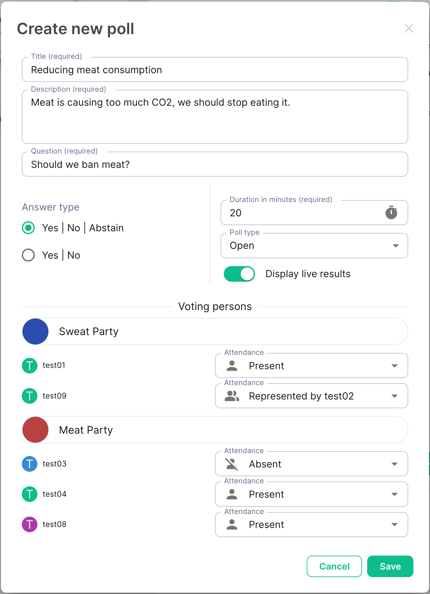
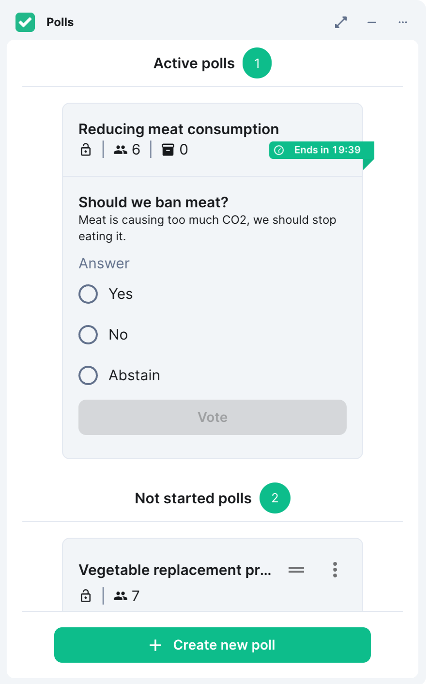
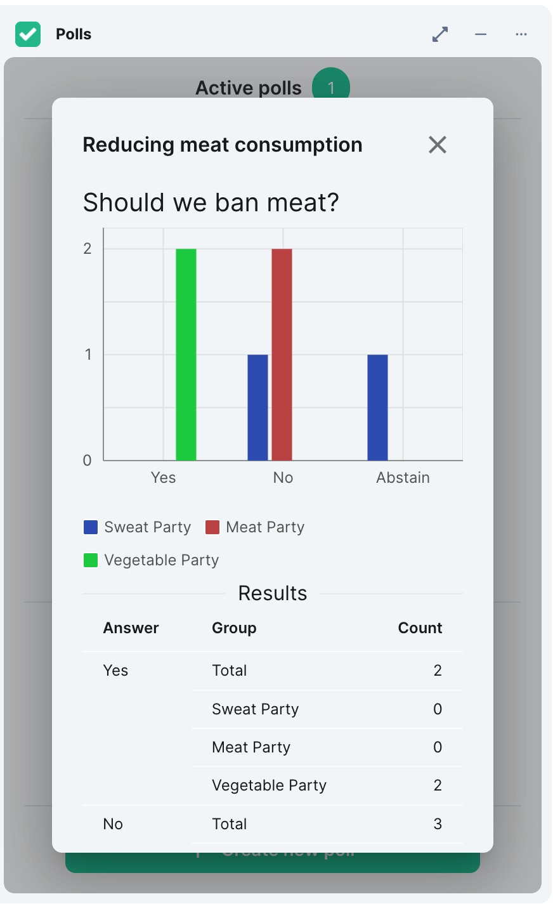
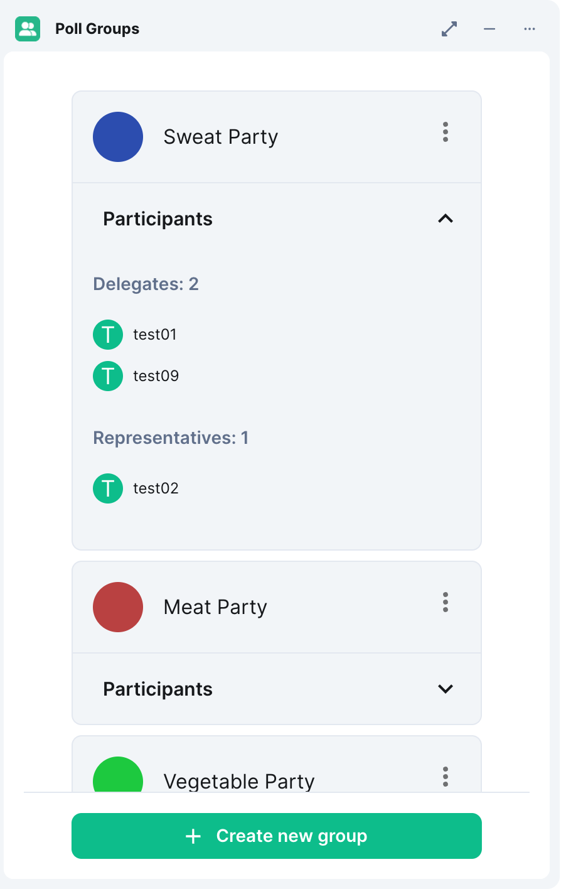

# NeoChoice


[](https://matrix.to/#/#nordeck:matrix.org)

This widget allows to conduct polls in Matrix rooms.
But unlike [MSC3381](https://github.com/matrix-org/matrix-spec-proposals/blob/travis/msc/polls/proposals/3381-polls.md), it is designed for more complex scenarios, like polls with multiple parties in a council.
You have full control over your data, as it's stored in your Matrix room.

It supports creating parties, assigning members to them, and handling representatives.
You can prepare multiple polls in advance and then run through them in a session.
After the registered users have voted, you can create a report with all results.

<table>
  <tr>
    <td>
      
    </td>
    <td>
      
    </td>
    <td>
      
    </td>
    <td>
      
    </td>
  </tr>
</table>

## Demo

Till now there is no officially hosted demo of the widget.
See the [Deployment](#deployment) section on how you can host the widget on your own.

## Getting Started

Development on the widget happens at [GitHub](https://github.com/nordeck/matrix-poll).

### How to Contribute

Please take a look at our [Contribution Guidelines](https://github.com/nordeck/.github/blob/main/docs/CONTRIBUTING.md).
Check the following steps to develop for the widget:

### Requirements

You need to install Node.js (`>= 20.0.0`, prefer using an LTS version) and run
`yarn` to work on this package.
The minimal Element version to use this widget is `1.11.8`.

### Installation

After checkout, run `yarn install` to download the required dependencies

> **Warning** Do not use `npm install` when working with this package.

### Configuration

Rename the provided `.env.local.default` to `.env.local` and fill it with your configuration.
For a list of available options, see [Configuration](./docs/configuration.md).

### Running the Widget Locally

Follow the [instructions to run the widget locally](https://github.com/nordeck/matrix-widget-toolkit/tree/main/example-widget-mui#running-the-widget-locally).
The widget comes with two routes, visit them and follow the further instructions:

- The poll widget itself, providing the voting view: `http(s)://localhost:5273/`
- The admin widget, providing the group configuration: `http(s)://localhost:5273/admin/`

### Available Scripts

In the project directory, you can run:

- `yarn dev`: Start the widget for development.
- `yarn dev:https`: Start the widget for development with a self-signed HTTPS certificate.
- `yarn build`: Build the production version of the widget.
- `yarn preview`: Preview a production build of the widget.
- `yarn preview:https`: Preview a production build of the widget with a self-signed HTTPS certificate.
- `yarn test`: Watch all files for changes and run tests.
- `yarn tsc`: Check TypeScript types for errors in the widget.
- `yarn lint`: Run eslint on the widget.
- `yarn prettier:write`: Run prettier on all files to format them.
- `yarn depcheck`: Check for missing or unused dependencies.
- `yarn deduplicate`: Deduplicate dependencies in the `yarn.lock` file.
- `yarn changeset`: Generate a changeset that provides a description of a
  change.
- `yarn translate`: Update translation files from code.
- `yarn generate-disclaimer`: Generates license disclaimer and include it in the build output.
- `yarn docker:build`: Builds a container from the output of `yarn build` and `yarn generate-disclaimer`.
- `yarn docker:run`: Runs the container and serves the widget at [http://localhost:3000](http://localhost:3000).
- `yarn docker:stop`: Stops the running container.
- `yarn docker:remove`: Removes and stops the running container.

### Versioning

This package uses automated versioning.
Each change should be accompanied with a specification of the impact (`patch`, `minor`, or `major`) and a description of the change.
Use `yarn changeset` to generate a new changeset for a pull request.
Learn more in the [`.changeset` folder](./.changeset).

Once the change is merged to `main`, a “Version Packages” pull request will be created.
As soon as the project maintainers merged it, the package will be released and the container is published.

### Architecture Decision Records

We use [Architecture Decision Records (ADR)s](https://github.com/nordeck/matrix-widget-toolkit/blob/main/docs/adrs/adr001-use-adrs-to-document-decisions.md) to document decisions for our software.
You can find them at [`/docs/adrs`](./docs/adrs/).

## Deployment

Yon can run the widget using Docker:

```sh
docker run --rm -e REACT_APP_HOME_SERVER_URL=https://matrix-client.matrix.org -p 8080:8080 ghcr.io/nordeck/matrix-poll-widget:latest
```

Be sure, that you also read the security notes in the base image [@matrix-widget-toolkit/widget-server](https://github.com/nordeck/matrix-widget-toolkit/tree/main/containers/widget-server) docs.

Our docker image supports customizing the nginx config by supplying additional config files.
For example, this allows running the image in an IPv4-only environment, as demonstrated at <https://github.com/nordeck/matrix-widget-toolkit/tree/main/containers/widget-server#custom-listen-directive>

We also provide a [HELM chart](./charts/).

## Supply Chain Security

To ensure transparency and security in our software supply chain, we provide comprehensive Software Bill of Materials (SBOM) reports for this project and signed container images.

### SBOM Reports

We provide SBOM reports within the widget container and as a release artifact.

- The generated SBOM report is available alongside the hosted widget assets, and can be found at `<DEPLOYMENT-URL>/sbom.spdx.json`, or via the filesystem at `/usr/share/nginx/html/sbom.spdx.json`
- Each GitHub release has a corresponding image SBOM scan report file attached as a release asset

### Signed Container Images

The container images releases are signed by [cosign](https://github.com/sigstore/cosign) using identity-based ("keyless") signing and transparency.
Execute the following command to verify the signature of a container image:

```sh
cosign verify \
--certificate-identity-regexp https://github.com/nordeck/matrix-poll/.github/workflows/publish-release.yml@refs/tags/v \
--certificate-oidc-issuer https://token.actions.githubusercontent.com \
ghcr.io/nordeck/matrix-poll-widget:<version> | jq
```

### Matrix Room Upgrades

The widget room can be [upgraded](https://matrix.org/docs/communities/administration/#room-upgrades).
Before the upgrade it is strongly recommended to download any necessary poll data by exporting it as PDF.
After the upgrade, the poll widget needs to be configured in the new room.

If you are using the widget as part of [NeoDateFix](https://github.com/nordeck/matrix-meetings), then
please refer to it's [documentation](https://github.com/nordeck/matrix-meetings/blob/main/README.md#matrix-room-upgrades)
about room upgrades.

Matrix room version 12 is supported from NeoChoice version [1.6.0](https://github.com/nordeck/matrix-poll/releases/tag/v1.6.0).

## License

This project is licensed under [APACHE 2.0](./LICENSE).

The disclaimer for other OSS components can be accessed via the `/NOTICE.txt` endpoint.
The list of dependencies and their licenses are also available in a maschine readable format at `/usr/share/nginx/html/licenses.json` in the container image.

## Sponsors

<p align="center">
   <a href="https://www.dphoenixsuite.de/"></a>
   &nbsp;&nbsp;&nbsp;&nbsp;
   <a href="https://www.dataport.de/"></a>
   &nbsp;&nbsp;&nbsp;&nbsp;
   <a href="https://www.nordeck.net/"></a>
</p>

This project is part of the [dPhoenixSuite by Dataport](https://www.dphoenixsuite.de/).
